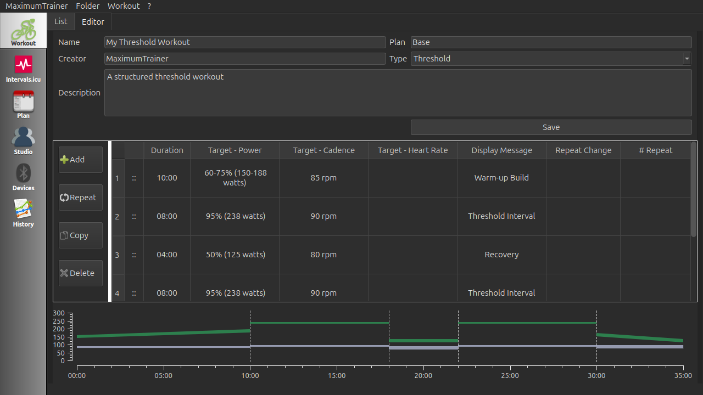
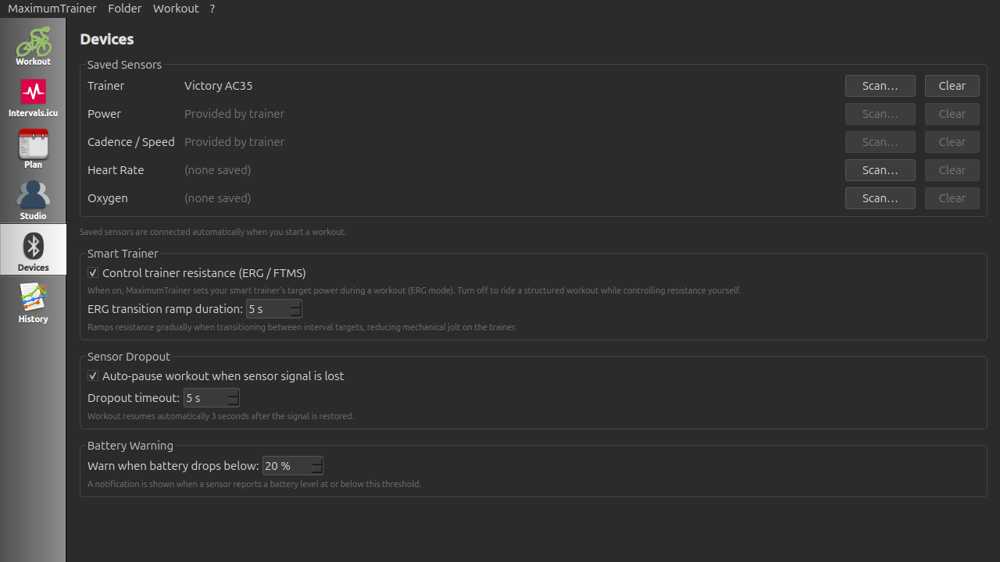

# MaximumTrainer

An open-source, high-performance indoor cycling training application built with the **Qt framework (C++17)**. MaximumTrainer delivers structured interval workouts with real-time power, cadence, heart rate, and speed feedback, and controls smart trainers automatically via FTMS ERG mode. Browse and sync workouts from [intervals.icu](https://www.intervals.icu), or import your own `.erg` / `.mrc` / `.zwo` files.

> 📖 **Want to use the app?** See the **[User Guide](https://maximumtrainer.github.io/MaximumTrainer_Redux/user-guide.html)** — pairing sensors, finding & building workouts, training, Studio mode, and more.

## Download

Prebuilt binaries for each release live on the [**Releases**](https://github.com/MaximumTrainer/MaximumTrainer_Redux/releases) page — you don't need to build from source unless you want to. Grab the asset for your platform from the latest release:

| Platform | Asset | Notes |
|----------|-------|-------|
| **Linux** | `MaximumTrainer-linux-x86_64.AppImage` | `chmod +x` it and run — self-contained, no install |
| **Windows** | `MaximumTrainer-windows-x64.msi` (installer) or `-windows-x64.zip` (portable) | Windows 10 1703+ |
| **macOS** | `MaximumTrainer-macos.dmg` | Open and drag to Applications |
| **Web (WASM)** | `MaximumTrainer-wasm.zip` | Runs in a WebAssembly-capable browser |

Prefer to compile it yourself? See [Building](#building) below.

## Technical Overview

| Item | Details |
|------|---------|
| **Language** | C++17 (≈ 95 % C++) |
| **Framework** | Qt 6 (6.7+) on all platforms |
| **Build file** | `MaximumTrainer.pro` (qmake) |
| **Qt modules** | core · gui · widgets · network · bluetooth · webenginewidgets · printsupport · concurrent |
| **Trainer protocol** | Bluetooth LE Fitness Machine Service (FTMS / 0x1826) for ERG resistance control |
| **Sensor profiles** | Heart Rate (0x180D) · Cycling Speed & Cadence (0x1816) · Cycling Power (0x1818) · Moxy Muscle Oxygen (0xAAB0) |
| **Workout formats** | `.erg`, `.mrc`, `.zwo` (imported and converted to the native XML format) · Intervals.icu calendar sync · export as `.fit` |
| **Workout source** | Integrated intervals.icu for online workout plans |

## Using MaximumTrainer

For everything about **using** the app — pairing sensors, finding / importing / creating workouts, ERG vs Slope, the workout player (video · web · Retro Race game), Studio mode, activity uploads, and troubleshooting — see the **[User Guide](https://maximumtrainer.github.io/MaximumTrainer_Redux/user-guide.html)**.

> **No hardware?** A built-in **Simulation** mode emits realistic drifting power / HR / cadence /
> speed and responds to ERG commands, so you can exercise the full workout flow — handy for
> development and CI — without any Bluetooth devices.

## Screenshots

| Workout library |
|-----------------|
|  |

| Workout editor |
|----------------|
|  |

| Devices — pairing & trainer config |
|------------------------------------|
|  |

| Workout in progress |
|---------------------|
|  |

| Studio mode — per-rider configuration |
|---------------------------------------|
|  |

## Building

All three platforms are built and tested automatically via GitHub Actions CI (see `.github/workflows/build.yml`). Use `MaximumTrainer.pro` with `qmake` and a standard C++ compiler.

### Dependencies

| Dependency | Version | Platform | Notes |
|------------|---------|----------|-------|
| Qt | 6.x (6.7+) | all | Core framework (incl. QtMultimedia, QtWebEngine, QtBluetooth) |
| QWT | 6.3.0 | all | Plotting widgets (built from source against Qt 6) |

> **Audio & media playback:** both sound-effect feedback (interval beeps, etc.,
> via `QSoundEffect`) and the embedded video + internet-radio player
> (`QMediaPlayer` / `QVideoWidget` / `QAudioOutput`) use Qt's own
> **QtMultimedia**.

## Windows — Requirements

- **Windows 10 version 1703 (Creators Update) or later is required.**
  Windows 7, 8, and 8.1 are not supported (missing WinRT BLE APIs).
- A Bluetooth 4.0+ adapter with a WDM-compatible driver.
- No special permissions or manifest entries are needed.

### Windows

**Required tools:** Qt 6.x (msvc2019_64, with the `qtwebengine`, `qtconnectivity`,
`qtmultimedia`, `qtwebchannel`, `qtpositioning` modules), Visual Studio 2019+ (MSVC).

**Environment variables** — set before running `qmake`:

| Variable | Description | Example |
|----------|-------------|---------|
| `QTDIR` | Qt installation root for the target arch | `C:\Qt\6.11.1\msvc2019_64` |
| `QWT_INSTALL` | QWT installation root (built against Qt 6) | `C:/qwt` |

**qmake invocation:**
```powershell
qmake MaximumTrainer.pro `
  "QWT_INSTALL=C:/qwt"
```

> The Windows Kit libraries (`Gdi32`, `User32`) are resolved automatically by the MSVC linker.

**Download links:**
- Qt 6.x: https://www.qt.io/download
- QWT 6.3.0: https://sourceforge.net/projects/qwt/files/qwt/6.3.0/

### Linux

Install Qt 6 + dependencies, build QWT 6 from source (no Qt6 `qwt` apt package
exists), then build the app:

```bash
sudo apt-get install -y \
  qt6-base-dev qt6-webengine-dev qt6-connectivity-dev \
  qt6-multimedia-dev qt6-webchannel-dev qt6-positioning-dev \
  cmake build-essential

# Build QWT 6.3.0 from source against Qt 6 (installs to /tmp/qwt6 here)
cd /tmp && curl -L -o qwt.tar.bz2 \
  "https://sourceforge.net/projects/qwt/files/qwt/6.3.0/qwt-6.3.0.tar.bz2/download"
tar xf qwt.tar.bz2 && cd qwt-6.3.0
qmake6 qwt.pro && make -j$(nproc)
make install INSTALL_ROOT=/tmp/qwt6-stage
mkdir -p /tmp/qwt6 && mv /tmp/qwt6-stage/usr/local/qwt-6.3.0/* /tmp/qwt6/

# Build MaximumTrainer
cd /path/to/MaximumTrainer_Redux
qmake6 MaximumTrainer.pro QWT_INSTALL=/tmp/qwt6
make -j$(nproc)
# Run (QWT in a non-standard prefix needs LD_LIBRARY_PATH):
LD_LIBRARY_PATH=/tmp/qwt6/lib ./build/release/MaximumTrainer
```

> **Wayland:** QtWebEngine and some embedded native widgets are more stable under
> XWayland than the native Wayland QPA plugin, so on a Wayland session the app
> forces the `xcb` platform automatically. Set `QT_QPA_PLATFORM` yourself to override.

### macOS

Uses Qt 6.11.1 with Clang. QWT is built from source (non-framework) against Qt 6.

> **macOS Bluetooth permission:** The app's `mac/Info.plist` includes the `NSBluetoothAlwaysUsageDescription` key, which is required by macOS 10.15+ for any app that accesses BLE devices. The first time the app attempts to connect a sensor, macOS will prompt for Bluetooth permission. This permission can be reviewed or revoked in **System Settings → Privacy & Security → Bluetooth**.

```bash
# Install Qt 6.11.1 via install-qt-action or the Qt Installer, then:

# Build QWT 6.3.0 from source (non-framework, required for Qt 6)
curl -L -o /tmp/qwt.tar.bz2 "https://sourceforge.net/projects/qwt/files/qwt/6.3.0/qwt-6.3.0.tar.bz2/download"
tar -xjf /tmp/qwt.tar.bz2 -C /tmp && cd /tmp/qwt-6.3.0
sed -i.bak 's/QwtFramework//' qwtconfig.pri
qmake qwt.pro && make -j$(sysctl -n hw.logicalcpu) && sudo make install

# Build MaximumTrainer
cd /path/to/MaximumTrainer_Redux
qmake MaximumTrainer.pro \
  "QWT_INSTALL=/usr/local/qwt-6.3.0"
make
```

## Testing

MaximumTrainer has a multi-tier test suite covering BLE parsing, service APIs, UI flows, and integration scenarios — all run headlessly in CI without real hardware.

### Test tiers

| Suite | Location | What is tested |
|-------|----------|----------------|
| BLE unit tests | `tests/btle/` | BLE characteristic parsing (HR, CSC, Power, FTMS), SimulatorHub signal emission, trainer simulations (Elite, Wahoo KICKR, Garmin Tacx), battery level, interval summary |
| Service unit tests | `tests/strava/`, `tests/intervals_icu/` | HTTP request construction, auth headers, URL patterns, null-manager guards for the Strava and Intervals.icu upload services |
| ZWO importer tests | `tests/intervals_icu/` | Parsing of SteadyState, Ramp, IntervalsT, FreeRide, mixed, and malformed ZWO workout files |
| Credential store tests | `tests/credential_store/` | Round-trip read/write, overwrite, remove, missing key, multi-service, WASM no-op |
| Plan adherence tests | `tests/plan_adherence/` | Completed/skipped/substituted entries, adherence %, encode-decode, change signals |
| Logger tests | `tests/logger/` | Log level filtering, output format, file write enable/disable |
| Studio tests | `tests/studio/` | Multi-hub simultaneous signals, user-ID propagation, FTP scaling |
| Login screen tests | `tests/integration/` | OAuth dialog state, offline login path, Intervals.icu OAuth URL generation |
| Workout UI tests | `tests/integration/` | Full ERG session driven by SimulatorHub through WorkoutDialog; interval advancement; data accumulation |
| Offline / BLE integration | `tests/integration/` | BLE adapter smoke test, offline mode screenshot, runtime validation |
| Playwright (E2E) | `tests/playwright/` | WASM asset loading, Web Bluetooth API mock, login screen, landing page |

### Running the BLE unit tests

```bash
cd tests/btle
qmake btle_tests.pro
make -j$(nproc)
../../build/tests/btle_tests -v2
```

The BLE suite has **51 test cases** across HR parsing, CSC, Power, FTMS, trainer simulations, SimulatorHub, battery, and interval summary. See the [CI run status](https://github.com/MaximumTrainer/MaximumTrainer_Redux/actions) for pass/fail counts on Linux, Windows, and macOS.

## Log Files

MaximumTrainer writes diagnostic messages (network errors, BLE events, OAuth login steps) to a log
file. File logging is **enabled by default** on first launch; you can adjust the level or disable it
in **Preferences → Logging**.

| Platform | Default log file path |
|----------|-----------------------|
| **Windows** | `%APPDATA%\MaximumTrainer\MaximumTrainer.log`<br/>(e.g. `C:\Users\YourName\AppData\Roaming\MaximumTrainer\MaximumTrainer.log`) |
| **macOS** | `~/Library/Application Support/MaximumTrainer/MaximumTrainer.log` |
| **Linux** | `~/.local/share/MaximumTrainer/MaximumTrainer.log` (XDG data dir; override with `$XDG_DATA_HOME`) |

Set the log level to **Debug** before reproducing an issue, then attach the log file to your bug report.
The **Open log file** button in the Logging settings page opens the file directly in your default text editor.

For full troubleshooting guidance see the
[User Guide — Log Files & Troubleshooting](https://maximumtrainer.github.io/MaximumTrainer_Redux/user-guide.html#log-files)
section.

## TODO

Project now going through new revisions, with plans to enhance as an open-source interval trainer for indoor cycling & indoor rowing.
backlog and work items can be found [here](https://github.com/users/MaximumTrainer/projects/2/views/1)
