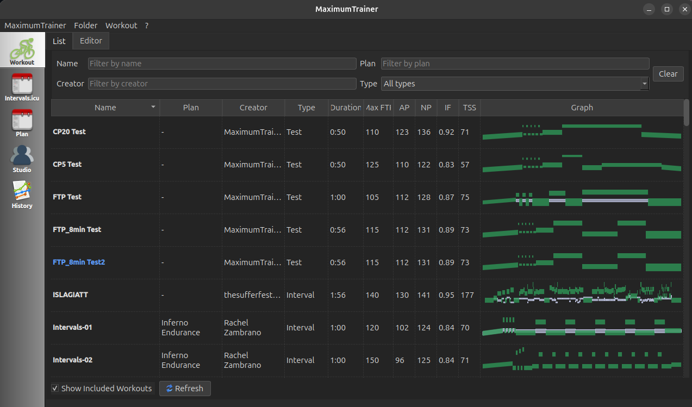
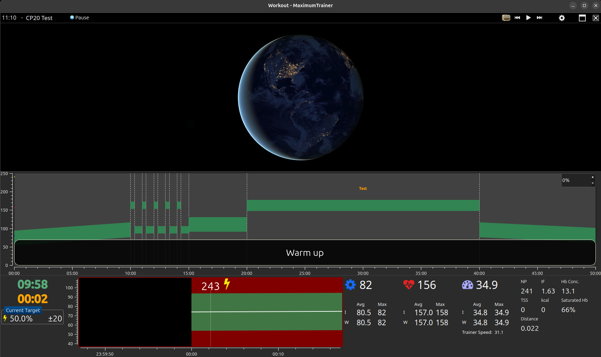
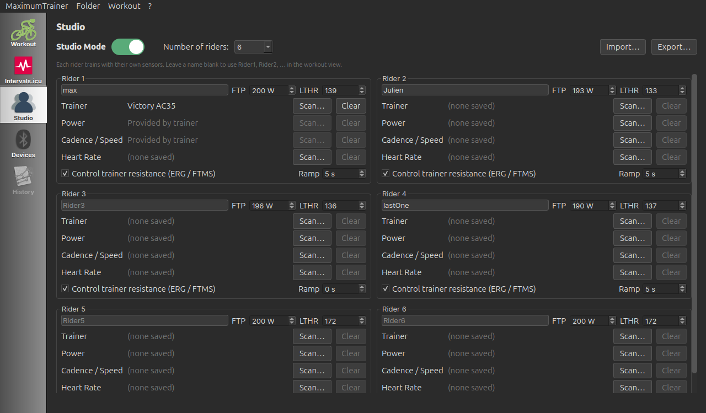

# MaximumTrainer

An open-source, high-performance indoor cycling training application built with the **Qt framework (C++17)**. MaximumTrainer delivers structured interval workouts with real-time power, cadence, heart rate, and speed feedback, and controls smart trainers automatically via FTMS ERG mode. Browse and sync workouts from [intervals.icu](https://www.intervals.icu), or import your own `.erg` / `.mrc` / `.zwo` files.

## Technical Overview

| Item | Details |
|------|---------|
| **Language** | C++17 (≈ 95 % C++) |
| **Framework** | Qt 6 (6.7+) on all platforms |
| **Build file** | `PowerVelo.pro` (qmake) |
| **Qt modules** | core · gui · widgets · network · bluetooth · webenginewidgets · printsupport · concurrent |
| **Trainer protocol** | Bluetooth LE Fitness Machine Service (FTMS / 0x1826) for ERG resistance control |
| **Sensor profiles** | Heart Rate (0x180D) · Cycling Speed & Cadence (0x1816) · Cycling Power (0x1818) · Moxy Muscle Oxygen (0xAAB0) |
| **Workout formats** | `.erg`, `.mrc`, `.zwo` (imported and converted to the native XML format) · Intervals.icu calendar sync · export as `.fit` |
| **Workout source** | Integrated intervals.icu for online workout plans |

## Hardware Setup

### 1 — Wake up your sensors

| Device | How to wake it |
|--------|---------------|
| Smart trainer | Start pedalling for a few seconds |
| Power meter | Start pedalling |
| Heart rate strap | Moisten the electrode contacts and put it on |
| Speed / cadence sensor | Spin the crank or wheel |

### 2 — Connect in the app

1. Launch MaximumTrainer and log in.
2. From the main window open **Preferences → Device Connections** (or press the gear icon).
3. Click **Scan / Add Devices**. The BTLE scanner lists every nearby Bluetooth LE device.
4. Select the correct profile for each sensor:

| Profile | UUID | Data provided | Smart-trainer ERG control |
|---------|------|--------------|--------------------------|
| Heart Rate Monitor | 0x180D | Heart rate (bpm) | No |
| Cycling Speed & Cadence | 0x1816 | Speed (km/h) · Cadence (RPM) | No |
| Cycling Power | 0x1818 | Power (W) | No |
| **Fitness Machine (FTMS)** | **0x1826** | Speed · Cadence · Power | **Yes — enables ERG mode** |
| Moxy Muscle Oxygen | 0xAAB0 | SmO₂ (%) · tHb (g/dL) | No |

> **Important:** Select the **Fitness Machine (FTMS / 0x1826)** profile for your smart trainer if you want the app to set resistance automatically. Choosing a plain Power or Speed profile disables ERG control.

5. Paired sensors appear with a green indicator. You can pair multiple sensors simultaneously (e.g. FTMS trainer + HR strap).

### Simulation mode

If you have no hardware — or want to test a new workout — choose **Simulation** in the connection dialog. The software hub emits realistic drifting values:

| Channel | Base value | Range |
|---------|-----------|-------|
| Heart rate | 140 bpm | 125–165 bpm |
| Cadence | 90 rpm | 80–100 rpm |
| Speed | 28 km/h | 23–33 km/h |
| Power | 200 W | 170–260 W |

The simulator responds to ERG load commands from the workout player, making it a full end-to-end test of the training logic without any Bluetooth hardware.

## User Guide

### Selecting a workout

**Option A — Intervals.icu calendar sync (integrated)**

1. On the login screen click **Connect with Intervals.icu** and authorise the app via OAuth (one-time setup).
2. Click the **Intervals.icu** tab in the left sidebar.
3. Click **Refresh** to load your planned workouts for the current week.
4. Select a workout and click **Load Selected Workout** to download it to your local library.

**Option B — Import a custom file**

1. Go to **File → Import Workout** (or **File → Import Course Folder** for batch import).
2. Select one or more `.erg` or `.mrc` files.
3. MaximumTrainer converts them to its native format and adds them to your library.

> `.zwo` workouts are imported automatically via Intervals.icu calendar sync; the manual File → Import dialog accepts `.erg` and `.mrc`.

**Option C — Create your own**

Use the built-in **Workout Creator** (toolbar → pencil icon) to build structured intervals with configurable power, cadence, or HR targets.

### Workout modes

| Mode | How it works | Best for |
|------|-------------|---------|
| **ERG** | App automatically adjusts trainer resistance so your actual power matches the target wattage. You control only cadence. | Structured interval workouts |
| **Slope / Manual** | App sends a constant incline grade to the trainer. Resistance changes naturally with speed, just like riding outdoors. | Free-riding, ramp tests, courses |

The workout dialog switches to Slope mode automatically when the current interval has no power target, or when you press **Increase / Decrease Difficulty** to override ERG.

### The Workout Player

Once a workout starts you will see:

- **Interval countdown** — time remaining in the current interval, and total workout time elapsed / remaining.
- **Target vs. Actual Power graph** — a QWT-based real-time plot showing the structured intervals as coloured zones and your live power overlaid on top.
- **Metrics widgets** — live Heart Rate · Cadence · Speed · Power · Left/Right Power Balance (if a dual-sided power meter is connected) · SmO₂ / tHb (if a Moxy muscle-oxygen sensor is connected).
- **Controls** — Start/Pause, Skip Interval, Adjust Difficulty (±5 % FTP increments), and Lap.

Completed workout data is saved as a FIT activity file and can be uploaded to **Strava**, **TrainingPeaks**, **SelfLoops**, or **Intervals.icu** from the post-workout screen.

> **Video & radio:** the workout view has a built-in media player (QtMultimedia) for local video files and internet-radio audio streams. Right-click the video area to open a file or URL and to adjust volume.

## Screenshots

| Workout list | Workout in progress |
|--------------|---------------------|
|  |  |

| Studio mode | Activity history |
|-------------|------------------|
|  |  |

## Linux — Bluetooth Setup

Before running MaximumTrainer on Linux, ensure the following prerequisites are met:

### 1 — BlueZ daemon

BlueZ is the Linux Bluetooth stack. Install it and make sure the daemon starts automatically:

```bash
sudo apt-get install -y bluez
sudo systemctl enable --now bluetooth
```

Verify the daemon is active:

```bash
sudo systemctl status bluetooth
```

### 2 — Add your user to the `bluetooth` group

If the BLE device scanner shows an empty list and no error, the most common cause is that your account is not in the `bluetooth` group:

```bash
sudo usermod -aG bluetooth $USER
```

> **Important:** Group changes take effect only after you **log out and back in** (or reboot). You can apply the change to the current shell session immediately — without logging out — by running:
> ```bash
> newgrp bluetooth
> ```

### 3 — Confirm your adapter supports Bluetooth LE (4.0+)

MaximumTrainer requires a Bluetooth 4.0 or newer adapter to communicate with BLE sensors and trainers. Check your adapter:

```bash
hciconfig -a
```

Look for `LMP Version: 6` (BT 4.0) or higher in the output. If `hciconfig` is not available, use:

```bash
bluetoothctl show
```

### 4 — Verify required kernel modules are loaded

The following kernel modules must be loaded:

| Module | Purpose |
|--------|---------|
| `bluetooth` | Core BLE/Bluetooth stack |
| `hci_uart` | UART-attached adapters (most USB dongles) |
| `btusb` | USB Bluetooth adapters |

Check and load if needed:

```bash
lsmod | grep -E "bluetooth|hci_uart|btusb"
# If missing, load manually:
sudo modprobe bluetooth
sudo modprobe btusb
```

On most modern distributions (Ubuntu 20.04+, Fedora 36+) these modules load automatically when a Bluetooth adapter is detected.

---

## Building

All three platforms are built and tested automatically via GitHub Actions CI (see `.github/workflows/build.yml`). Use `PowerVelo.pro` with `qmake` and a standard C++ compiler.

### Dependencies

| Dependency | Version | Platform | Notes |
|------------|---------|----------|-------|
| Qt | 6.x (6.7+) | all | Core framework (incl. QtMultimedia, QtWebEngine, QtBluetooth) |
| QWT | 6.2.0 | all | Plotting widgets (built from source against Qt 6) |
| SFML | system / 2.6+ | all | Sound-effect feedback (interval beeps, etc.) |

> **Media playback:** the embedded video + internet-radio player uses Qt's own
> **QtMultimedia** (`QMediaPlayer` / `QVideoWidget` / `QAudioOutput`). There is no
> VLC dependency.

## Windows — Requirements

- **Windows 10 version 1703 (Creators Update) or later is required.**
  Windows 7, 8, and 8.1 are not supported (missing WinRT BLE APIs).
- A Bluetooth 4.0+ adapter with a WDM-compatible driver.
- No special permissions or manifest entries are needed.

### Windows

**Required tools:** Qt 6.x (msvc2019_64, with the `qtwebengine`, `qtconnectivity`,
`qtmultimedia`, `qtwebchannel`, `qtpositioning` modules), Visual Studio 2019+ (MSVC).

**Environment variables** — set before running `qmake`:

| Variable | Description | Example |
|----------|-------------|---------|
| `QTDIR` | Qt installation root for the target arch | `C:\Qt\6.7.3\msvc2019_64` |
| `QWT_INSTALL` | QWT installation root (built against Qt 6) | `C:/qwt` |

**qmake invocation:**
```powershell
qmake PowerVelo.pro `
  "QWT_INSTALL=C:/qwt" `
  "SFML_INSTALL=C:/sfml/SFML-2.6.1"
```

> `SFML_INSTALL` must point to the SFML root (the directory containing `include/` and `lib/`).
> The Windows Kit libraries (`Gdi32`, `User32`) are resolved automatically by the MSVC linker.

**Download links:**
- Qt 6.x: https://www.qt.io/download
- SFML (vc17 64-bit): https://github.com/SFML/SFML/releases
- QWT 6.2.0: https://sourceforge.net/projects/qwt/files/qwt/6.2.0/

### Linux

Install Qt 6 + dependencies, build QWT 6 from source (no Qt6 `qwt` apt package
exists), then build the app:

```bash
sudo apt-get install -y \
  qt6-base-dev qt6-webengine-dev qt6-connectivity-dev \
  qt6-multimedia-dev qt6-webchannel-dev qt6-positioning-dev \
  libsfml-dev cmake build-essential

# Build QWT 6.2.0 from source against Qt 6 (installs to /tmp/qwt6 here)
cd /tmp && curl -L -o qwt.tar.bz2 \
  "https://sourceforge.net/projects/qwt/files/qwt/6.2.0/qwt-6.2.0.tar.bz2/download"
tar xf qwt.tar.bz2 && cd qwt-6.2.0
qmake6 qwt.pro && make -j$(nproc)
make install INSTALL_ROOT=/tmp/qwt6-stage
mv /tmp/qwt6-stage/usr/local/qwt-6.2.0 /tmp/qwt6

# Build MaximumTrainer
cd /path/to/MaximumTrainer_Redux
qmake6 PowerVelo.pro QWT_INSTALL=/tmp/qwt6
make -j$(nproc)
# Run (QWT in a non-standard prefix needs LD_LIBRARY_PATH):
LD_LIBRARY_PATH=/tmp/qwt6/lib ./build/release/MaximumTrainer
```

> **Wayland:** QtWebEngine and some embedded native widgets are more stable under
> XWayland than the native Wayland QPA plugin, so on a Wayland session the app
> forces the `xcb` platform automatically. Set `QT_QPA_PLATFORM` yourself to override.

### macOS

Uses Qt 6.7.3 with Clang. QWT is built from source (non-framework) against Qt 6.

> **macOS Bluetooth permission:** The app's `mac/Info.plist` includes the `NSBluetoothAlwaysUsageDescription` key, which is required by macOS 10.15+ for any app that accesses BLE devices. The first time the app attempts to connect a sensor, macOS will prompt for Bluetooth permission. This permission can be reviewed or revoked in **System Settings → Privacy & Security → Bluetooth**.

```bash
# Install Qt 6.7.3 via install-qt-action or the Qt Installer, then:
brew install sfml

# Build QWT 6.2.0 from source (non-framework, required for Qt 6)
curl -L -o /tmp/qwt.tar.bz2 "https://sourceforge.net/projects/qwt/files/qwt/6.2.0/qwt-6.2.0.tar.bz2/download"
tar -xjf /tmp/qwt.tar.bz2 -C /tmp && cd /tmp/qwt-6.2.0
sed -i.bak 's/QwtFramework//' qwtconfig.pri
qmake qwt.pro && make -j$(sysctl -n hw.logicalcpu) && sudo make install

# Build MaximumTrainer
cd /path/to/MaximumTrainer_Redux
qmake PowerVelo.pro \
  "SFML_INSTALL=$(brew --prefix sfml)" \
  "QWT_INSTALL=/usr/local/qwt-6.2.0"
make
```

## Testing

MaximumTrainer has a multi-tier test suite covering BLE parsing, service APIs, UI flows, and integration scenarios — all run headlessly in CI without real hardware.

### Test tiers

| Suite | Location | What is tested |
|-------|----------|----------------|
| BLE unit tests | `tests/btle/` | BLE characteristic parsing (HR, CSC, Power, FTMS), SimulatorHub signal emission, trainer simulations (Elite, Wahoo KICKR, Garmin Tacx), battery level, interval summary |
| Service unit tests | `tests/strava/`, `tests/trainingpeaks/`, `tests/selfloops/`, `tests/intervals_icu/` | HTTP request construction, auth headers, URL patterns, null-manager guards for all cloud upload services |
| ZWO importer tests | `tests/intervals_icu/` | Parsing of SteadyState, Ramp, IntervalsT, FreeRide, mixed, and malformed ZWO workout files |
| Credential store tests | `tests/credential_store/` | Round-trip read/write, overwrite, remove, missing key, multi-service, WASM no-op |
| Plan adherence tests | `tests/plan_adherence/` | Completed/skipped/substituted entries, adherence %, encode-decode, change signals |
| Logger tests | `tests/logger/` | Log level filtering, output format, file write enable/disable |
| Studio tests | `tests/studio/` | Multi-hub simultaneous signals, user-ID propagation, FTP scaling |
| Login screen tests | `tests/integration/` | OAuth dialog state, offline login path, Intervals.icu OAuth URL generation |
| Workout UI tests | `tests/integration/` | Full ERG session driven by SimulatorHub through WorkoutDialog; interval advancement; data accumulation |
| Offline / BLE integration | `tests/integration/` | BLE adapter smoke test, offline mode screenshot, runtime validation |
| Playwright (E2E) | `tests/playwright/` | WASM asset loading, Web Bluetooth API mock, login screen, landing page |

### Running the BLE unit tests

```bash
cd tests/btle
qmake btle_tests.pro
make -j$(nproc)
../../build/tests/btle_tests -v2
```

The BLE suite has **51 test cases** across HR parsing, CSC, Power, FTMS, trainer simulations, SimulatorHub, battery, and interval summary. See the [CI run status](https://github.com/MaximumTrainer/MaximumTrainer_Redux/actions) for pass/fail counts on Linux, Windows, and macOS.

## Log Files

MaximumTrainer writes diagnostic messages (network errors, BLE events, OAuth login steps) to a log
file. File logging is **enabled by default** on first launch; you can adjust the level or disable it
in **Preferences → Preferences & Profile → Logging**.

| Platform | Default log file path |
|----------|-----------------------|
| **Windows** | `%APPDATA%\MaximumTrainer\MaximumTrainer.log`<br/>(e.g. `C:\Users\YourName\AppData\Roaming\MaximumTrainer\MaximumTrainer.log`) |
| **macOS** | `~/Library/Application Support/MaximumTrainer/MaximumTrainer.log` |
| **Linux** | `~/.local/share/MaximumTrainer/MaximumTrainer.log` (XDG data dir; override with `$XDG_DATA_HOME`) |

Set the log level to **Debug** before reproducing an issue, then attach the log file to your bug report.
The **Open log file** button in the Logging settings page opens the file directly in your default text editor.

For full troubleshooting guidance (including the Intervals.icu login page) see the
[User Guide — Log Files & Troubleshooting](https://maximumtrainer.github.io/MaximumTrainer_Redux/user-guide.html#log-files)
section.

## TODO

Project now going through new revisions, with plans to enhance as an open-source interval trainer for indoor cycling & indoor rowing.
backlog and work items can be found [here](https://github.com/users/MaximumTrainer/projects/2/views/1)
